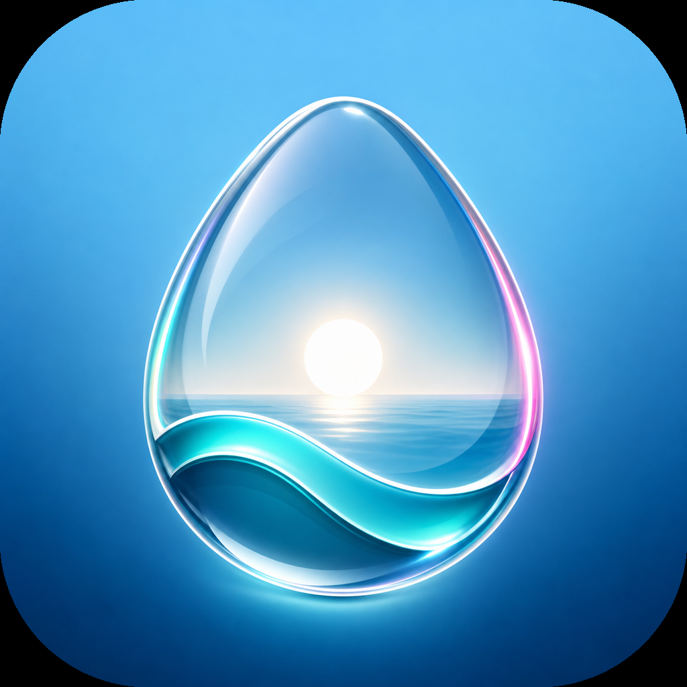

<p align="center">
  
</p>

<h1 align="center">Luma Wallpaper</h1>

<p align="center">清新、简约的图片与动态视频壁纸管理器，支持 macOS、Windows 和 Web 预览。</p>

<p align="center">
  <a href="https://github.com/loveOneBaby/luma-wallpaper/actions/workflows/release.yml"></a>
  <a href="https://github.com/loveOneBaby/luma-wallpaper/releases"></a>
</p>

## 功能

- 点击选择或拖拽上传自己的图片和视频
- 按全部、图片、视频、收藏分类管理
- 液态玻璃折射界面与响应式布局
- macOS、Windows 图片壁纸设置
- macOS、Windows 桌面层动态视频壁纸
- 壁纸冲突检测、未生效提示与重新应用
- 桌面端自动检测与下载更新，确认后关闭旧版本、安装并重新打开
- Web 端安全预览，不伪装系统壁纸设置能力

## 下载

稳定版本从 Cloudflare R2 公开存储下载（[pub-ddf8e64b029a4710bc22937d4c5ff992.r2.dev](https://pub-ddf8e64b029a4710bc22937d4c5ff992.r2.dev)）；`v0.1.5` 及更早版本仍在[源仓库 release 页](https://github.com/loveOneBaby/luma-wallpaper/releases)：

- macOS Apple Silicon：DMG 或 ZIP
- macOS Intel：DMG 或 ZIP
- Windows x64：`Luma-<version>-x64-Setup.exe` NSIS 安装程序
- Web：静态构建 ZIP

也可以在 [Build and Release](https://github.com/loveOneBaby/luma-wallpaper/actions/workflows/release.yml) 页面手动运行流水线，并从对应运行记录下载构建产物。

> `v0.1.4` 及更早的公开构建未进行 Apple Developer 公证或商业代码签名。macOS 首次打开时可能需要在系统安全设置中确认，Windows 也可能显示未知发布者提示。新的标签发布会强制要求 macOS Developer ID 签名和公证；Windows 未配置证书时仍可构建，但流水线会给出明确的未签名警告。

## 本地开发

```bash
npm ci
npm test
npm run dev
```

启动 Electron 桌面端：

```bash
npm run desktop:dev
```

构建当前平台：

```bash
npm run build
npm run desktop:build:mac
npm run desktop:build:win
```

## Web 部署

`.github/workflows/pages.yml` 会在 pull request 上执行依赖审计、测试、lint 和生产构建；推送到 `main` 后还会把 `dist` 发布到 GitHub Pages。

首次使用前，需要在仓库 **Settings → Pages → Build and deployment** 中将 Source 选为 **GitHub Actions**。配置后页面地址为：

<https://loveonebaby.github.io/luma-wallpaper/>

## 桌面端自动发布

推送与 `package.json` 版本一致的 `v*` 标签会构建全部平台，并把产物与更新清单上传到 Cloudflare R2 公开存储（扁平布局：根目录放 `latest.yml`、`latest-arm64-mac.yml`、`latest-x64-mac.yml` 和各版本二进制）。桌面端自动更新通过 electron-updater 的 `generic` provider 查询 `package.json` 里配置的 R2 公开 URL；源仓库的 release 页只保留历史版本。

```bash
git tag v0.1.6
git push origin v0.1.6
```

不要在仅修改版本号前提前创建标签；先等待 `main` 的 Web CI 通过，再推送标签。手动运行 `Build and Release` 会生成可下载的桌面端 Actions Artifacts，但不会创建 Release。桌面发布复用已经通过测试的 renderer 产物，不会在三个系统上重复构建前端。

流水线会同时发布 Windows `latest.yml`、macOS 分架构更新清单和差分下载 blockmap，并在上传前校验清单中的每个 URL、文件大小和 SHA-512。上传到 R2 后还会用 HTTP 逐份拉取远端清单与本地逐字比对，并对每个引用产物做 HEAD 请求校验 Content-Length 与清单 size 一致。

发布到 R2 需要在源仓库 Actions Secrets 配置 4 个 S3 兼容凭证（任缺即 fail-fast）：

- `R2_ACCOUNT_ID`、`R2_ACCESS_KEY_ID`、`R2_SECRET_ACCESS_KEY`、`R2_BUCKET`

并把 R2 bucket 的公开访问 URL 硬编码进 `package.json` 的 `build.*.publish[].url`（打进 `app-update.yml`）。URL 仍是占位时 release 作业会拒绝发布。

R2 bucket 需在 Cloudflare 后台开启公开访问（Settings → Public access），对象默认公开可读（无需 `--acl`）。`latest*.yml` 用 `no-cache`，版本化二进制用长期不可变缓存。

macOS 签名与公证凭据是可选的。完整配置以下 6 项会签名并公证（mac 自动更新随之生效）；全部留空则发布未签名版（mac 自动更新被运行时门禁关闭，仅带 `::warning`）；只配置其中几项会直接失败：

- `MAC_CSC_LINK`、`MAC_CSC_KEY_PASSWORD`
- `APPLE_API_KEY`（`.p8` 文件的 Base64 内容）、`APPLE_API_KEY_ID`、`APPLE_API_ISSUER`、`APPLE_TEAM_ID`

Windows Authenticode 签名同样可选，正式分发时强烈建议配置：

- `WIN_CSC_LINK`、`WIN_CSC_KEY_PASSWORD`

未配置 Windows 证书时，流水线会保留构建并标记为“未知发布者”；只配置其中一项会直接失败，避免误以为产物已签名。

`v0.1.2` 及更早版本本身没有更新模块，需要手动安装一次带更新模块的版本。现有未签名 macOS 客户端无法自动迁移到首个 Developer ID 签名版本，首个签名版仍需用户手动安装一次；此后的签名版本才能安全地自动更新。Windows 从具备更新模块的版本起，可以直接发现并安装修正后的更新清单。

打包时还会关闭 `ELECTRON_RUN_AS_NODE`、`NODE_OPTIONS` 和调试 CLI 入口，并启用 Cookie 加密、ASAR 完整性校验和仅从 `app.asar` 加载应用代码。

## 技术栈

- React 19 + Vite
- Electron 43 + electron-builder
- React Bits 风格 GlassSurface SVG 位移滤镜
- macOS desktop window / Windows WorkerW 动态壁纸层

Windows WorkerW 实现的第三方来源与许可见 [THIRD_PARTY_NOTICES.md](./THIRD_PARTY_NOTICES.md)。
